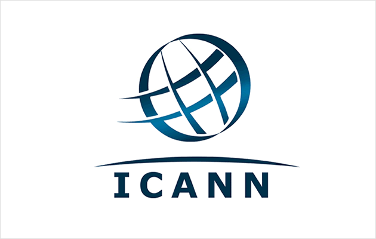

# Testing The DNS Setup

These instructions are for pointing your devices to the new private DNS you created, and to test DNSSEC with the DIG command.  I will also show you how to resolve handshake pages in your browser and ping some LAN clients.  [Want To Return to Start Page Click Here](./README.md)

<HR/>

### 1. Lets start digging to test the new DNS

Log into NS1 Pi#2 and start inputting these commands <br/>
If your on a different terminal within the LAN then replace  127.0.0.1 with the IP of the Unbound DNS server (NS1)

<h4>Test DNSSEC:		</h4>

$   `dig +dnssec @127.0.0.1 -p 53 sigfail.verteiltesysteme.net`

$   `dig +dnssec @127.0.0.1 -p 53 sigok.verteiltesysteme.net `	

The first command should give a status report of SERVFAIL and no IP address. <br/> The second should give NOERROR plus a IP address and a RRSIG (see pic below)

  <a href="https://github.com/Cloudchain_Main/guides">
   
  </a>

<br/>

<h4>Dig some WAN ICANN names </h4>

$ `dig yahoo.ca`

$ `dig google.com`
<br/><br/>
<h4>Dig a LAN computer in your local-zone </h4>

  This will return the IP of the 'wifi.tkg' LAN device

 $ `dig wifi.tkg`

 This will return the name of the device for the IP

$   `nslookup 192.168.50.16   `

<br/>
<h4>Dig some HSD handshake names </h4>
Once The Block Chain Downloads - Dig Some Handshake Names <br/><br/>

$   `dig @127.0.0.1 nb`

$   `dig @127.0.0.1 johnnywu`


If digging works - hsd works

<br/>

### 2. Point Your Device's To Your Unbound DNS -so you can resolve the names in your Web Browser

The IP for the NS1 server you wrote down in the previous step is required here. If you don't have it, go to the NS1 server PI#2 (the server you are on now) and get it.... type:
$ `hostname -I` on that server and write it down. Use it in the next command (we will use 10.10.0.203 in the examples below)

On your LAN, change each devices preferred and alternative DNS Network Settings to the IP you just wrote down (i.e. 10.10.0.203) or ```better yet change it only at your router and leave each computer to obtain DNS automatically```<br/><br/>

Windows Device Network Settings:

 

<br/><br/>
Router Settings:

  <a href="https://github.com/Cloudchain_Main/guides">
   
  </a>
  <br/>
<br/>

  ### 3. Browse Some Web Pages From Your device WEB Browser<br/><br/>
  <a href="https://github.com/Cloudchain_Main/guides">
      
  </a> <br/>
  ICANN names input as you normally would
  
  `yahoo.ca` `msn.com` 
    <br/><br/><br/>
  <a href="https://github.com/Cloudchain_Main/guides">
    
  </a><br/>
Handshake names are always followed by a trailing period and a slash ./ <br/> (otherwise the web browser will return a search result, not the handshake web page)<br/>
Tested with Microsoft Edge, Firefox & Chrome

`nb./` `sulu./`

<br/>
LAN devices that have a front end web interface are always input with a trailing /

`wifi.tkg/` `bell.tkg/
`

<hr/><hr/>

<h3> That's It, You Did It!</h3> You now have your own private DNS that can resolve ICANN, Handshake and LAN names <br/>  - you can move on to set up a VPN to use your DNS while your away from your LAN


<!-- DONATIMG -->
## Support The Guide

If you feel this guide helped you in any way, please consider donating to my HNS wallet <br/>  `hs1qskr248ggtwvyc2zz48xq78c4nqfef2xdwqw09f`  <br/>
Sending coins other than HNS will result in permanent loss. There is no way to recover those funds.  
Please send HNS only, thank you.


<!-- CONTACT -->
## Contact

weedman./ - [pleazu69#9513](https://discordapp.com/users/786316515086827540)

<hr/>
<h3>
<br/>

>> <br/> [Intial Read Me Page](./README.md)
</h3>
